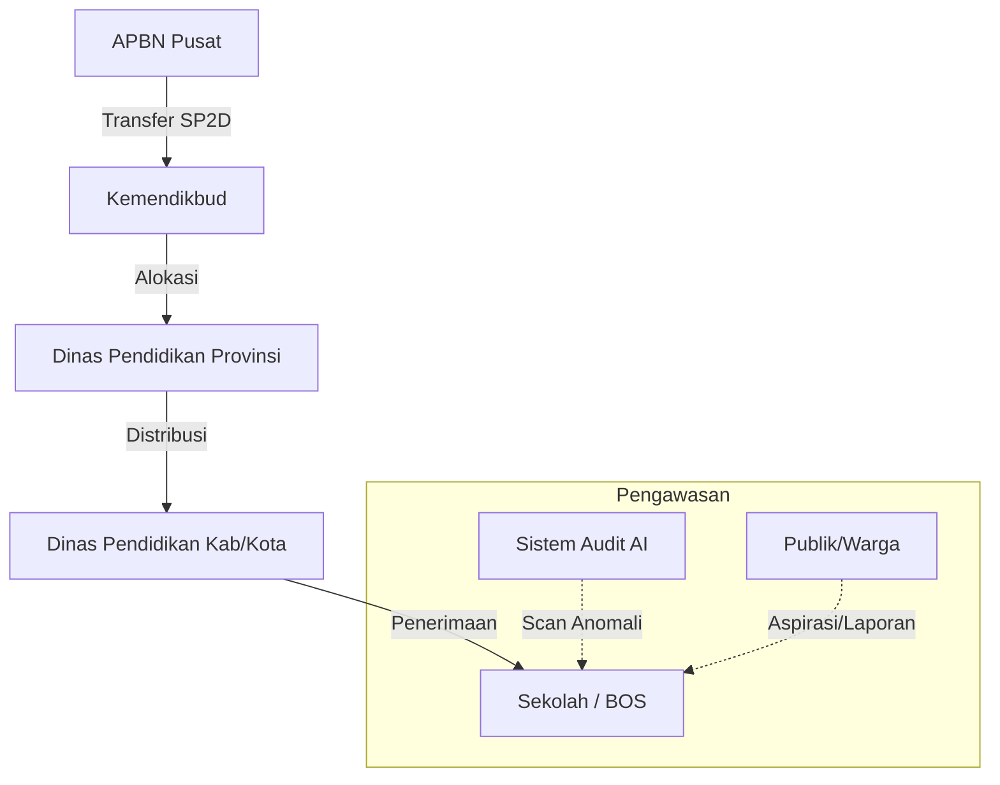

# 🏦 Transparansi Anggaran Pendidikan (Portal BOS Digital)

[](https://opensource.org/licenses/MIT)
[](https://nextjs.org/)
[](https://deepmind.google/technologies/gemini/)

## Pendahuluan 
Sebelum membaca dokumentasi kode ini secara lengkap, ada baiknya simak video Bintang Emon terlebih dahulu sebagai gambaran permasalahan yang terjadi dalam sebuah sistem anggaran https://vt.tiktok.com/ZSH2L1DVd/

## 🚀 Misi Proyek
Membangun sistem pengawasan anggaran pendidikan yang **end-to-end**, dari APBN Pusat hingga ke tangan sekolah, guna memastikan setiap rupiah sampai ke tujuannya tanpa dikorupsi. Platform ini memberikan visibilitas publik terhadap aliran dana dan audit otomatis berbasis AI terhadap kecurangan (markup/anomali).

Draft konsep dari Web Aplikasi ini ada di sini:https://docs.google.com/spreadsheets/u/0/d/18XTrxy175Fxzar1eJM_N5Wd8F67x7LWZAz_fwGrQ9gw/htmlview

Jika dikoneksikan dengan AI Agent seperti OpenClaw(https://www.instagram.com/reel/DU2gI3lk9cO) maka akan memudahkan dalam hal audit dan pelaporan, karena semuanya bisa diinstruksikan perintah nya ke OpenClaw dan semuanya dapat berjalan otomatis.

Tutorial untuk mengubah, mengembangkan atau memodifikasi source code ini ada di sini:https://youtu.be/eow7GpWb7UI?si=N-6pAOrpQnOiCYKK

---

## 🗺️ Fund Flow Architecture (Aliran Dana)

Sistem ini memecahkan masalah "dana gaib" with melacak rekonsiliasi angka di setiap level:



**Fitur Rekonsiliasi**: Jika Dana yang dialokasikan di Pusat tidak sama dengan yang diterima di Sekolah, sistem akan memberikan **! FLAG** (Anomali) secara otomatis untuk diperiksa oleh KPK/BPK.

Melaporkan dugaan korupsi ke KPK dapat dilakukan secara mudah, aman, dan tanpa biaya melalui situs **kws.kpk.go.id**, email **pengaduan@kpk.go.id**, WhatsApp **0811-959-575**, atau telepon ke **198**. Pastikan laporan memuat identitas jelas (dijamin rahasia), kronologi lengkap, bukti permulaan, dan lokasi kejadian.

**Metode 5W +1W + 1H**
1. Whats= Jelaskan proyek apa yang beranomali.
2. Why= Jelaskan kenapa proyek anomali tersebut terjadi.
3. When= Jelaskan kapan proyek anomali tersebut berjalan.
4. Where= Jelaskan dimana proyek anomali tersebut terjadi.
5. Who= Siapa yang terlibat dalam proyek anomali tersebut.
6. How= Jelaskan bagaimana proyek anomali tersebut dapat terlaksana/terjadi, penjelasan harus selengkap-lengkapnya.
7. Whom= Jika ada suap, siapa pelaku suap proyek anomali tersebut.

Langkah-langkah Membuat Laporan ke KPK:
1. Persiapkan Data dan Bukti: Kumpulkan dokumen, foto, rekaman, atau saksi yang berkaitan dengan dugaan tindak pidana korupsi (misalnya kuitansi, surat, atau bukti transfer).
2. Siapkan Identitas Pelapor: Identitas wajib diisi (nama, alamat, pekerjaan, nomor telepon). KPK menjamin kerahasiaan identitas pelapor, namun disarankan tidak mempublikasikan laporan sendiri.
3. Sampaikan Kronologi Jelas: Jelaskan siapa yang terlibat, apa tindakannya, kapan kejadiannya, di mana lokasi kejadian, dan bagaimana modus operandinya.

Pilih Saluran Pelaporan:
KWS (KPK Whistleblower System): Kunjungi laman kws.kpk.go.id.
Email: Kirimkan detail ke pengaduan@kpk.go.id.
WhatsApp: Kirim pesan ke 0811-959-575.
Call Center: Hubungi nomor 198.
Langsung/Surat: Mengirimkan surat ke Gedung Merah Putih KPK, Jl. Kuningan Persada Kav. 4, Jakarta Selatan 12950. 
www.kpk.go.id

KPK akan melakukan verifikasi dan menindaklanjuti laporan yang memenuhi kriteria (memiliki bukti dan informasi memadai) dalam waktu 30 hari kerja.

---

## ✨ Fitur Utama (MVP)

### 1. 🔍 Audit Otomatis AI (Gemini Pro)
- Mendeteksi potensi **Markup Harga** secara instan.
- Memberikan skor risiko terhadap setiap transaksi sekolah.
- Analisis tren belanja sekolah dibandingkan dengan harga pasar rata-rata.

### 2. 📝 Input Presisi & Itemized
- Pencatatan transaksi bukan sekadar nominal total.
- Mendukung rincian: Satuan (Liter, Pcs, dll), Harga Satuan, Pajak (PPN/PPh), dan Ongkos Kirim.
- Membantu sekolah dalam pelaporan mandiri yang lebih akuntabel.

### 3. 🏛️ Portal Auditor (Pusat)
- Dashboard khusus untuk Kemendikbud/KPK/BPK untuk memantau sekolah dengan risiko tertinggi secara nasional.
- Peta persebaran anggaran per wilayah.

### 4. 👫 Transparansi Publik (Citizen Oversight)
- Forum diskusi publik di setiap dashboard sekolah.
- Fitur "Beri Bintang" (Apresiasi Warga) untuk sekolah yang transparan.

---

## � Sumber Data & Integrasi

Aplikasi ini menggunakan data riil dan terstruktur untuk mensimulasikan penerapan di dunia nyata:
- **Data Induk Pendidikan (NPSN)**: Terintegrasi dengan format Data Pokok Pendidikan (Dapodik) Kemendikbud untuk validasi profil puluhan ribu sekolah di seluruh Indonesia.
- **Data Wilayah Administrasi**: Menggunakan data resmi Kepmendagri untuk hierarki wilayah yang presisi (Provinsi, Kabupaten/Kota, Kecamatan, hingga Desa/Kelurahan).
- **Alokasi APBN**: Model data yang merepresentasikan alur dana riil dari APBN Pusat, Transfer ke Daerah (TKD), hingga pencairan langsung ke rekening BOS Sekolah.

---

## �🛠️ Tech Stack
- **Frontend**: Next.js 15 (App Router), Tailwind CSS, Framer Motion.
- **Backend & DB**: Supabase (PostgreSQL), Row-Level Security (RLS).
- **Intelligence**: Google Gemini API (untuk audit AI).
- **Charts**: Recharts & Shadcn UI components.

---

## ⚙️ Cara Menjalankan Proyek

1. **Clone Repository**:
   ```bash
   git clone https://github.com/adimaryanto-stack/Transparansi-Anggaran-Pendidikan.git
   cd Transparansi-Anggaran-Pendidikan/apps/web-next
   ```

2. **Install Dependencies**:
   ```bash
   npm install
   ```

3. **Konfigurasi Environment**:
   Buat file `.env.local` dan isi dengan:
   ```env
   NEXT_PUBLIC_SUPABASE_URL=your_supabase_url
   NEXT_PUBLIC_SUPABASE_ANON_KEY=your_supabase_key
   GEMINI_API_KEY=your_gemini_api_key
   ```

4. **Jalankan Aplikasi**:
   ```bash
   npm run dev
   ```

---

## 📊 Roadmap & Planning
Proyek ini dikembangkan dalam beberapa fase:
- [x] **Fase 1-4**: Database Auth, AI Audit (Gemini), Fund Flow Tracking.
- [x] **Fase 5**: Integrasi OCR (Scan Nota) otomatis via Gemini Vision.
- [x] **Fase 6**: Advanced Dashboards & Multi-level Roles (`SUPER_ADMIN`, `SCHOOL`, dll).
- [x] **Fase 7**: Dashboard UI Redesign (SaaS Centered Layout, Dark mode prep).
- [ ] **Fase 8**: Peluncuran Publik & PWA Optimization.

---

---

## 📜 Change Log

### v1.0.0 (Current) - 11 Maret 2026, 11:07 WIB
- **Initial MVP Release**: Database Auth, AI Audit (Gemini), Fund Flow Tracking.
- **OCR Integration**: Scan nota otomatis via Gemini Vision.
- **Advanced Dashboards**: Multi-level roles (`SUPER_ADMIN`, `SCHOOL`, dll).
- **UI Redesign**: SaaS Centered Layout, Dark mode preparation.

---

## 🛠️ Prasyarat & Infrastruktur

Untuk menjalankan aplikasi ini secara penuh, diperlukan:
1. **Langganan Google One**: Dibutuhkan agar fitur AI (Gemini Pro & Vision) dapat berjalan maksimal, termasuk fitur OCR, Auditor AI, dan Suggest AI.
2. **Penyimpanan Database Remote**: Membutuhkan koneksi ke database eksternal seperti **Supabase** (rekomendasi) atau **Hostinger MySQL** untuk persistensi data yang aman.
3. **Server Backend**: Membutuhkan server (VPS/Cloud) untuk menjalankan API dan proses sinkronisasi data.
4. **Konektor Himbara**: Diperlukan integrasi/konektor dengan sistem perbankan Himbara sebagai eksekutor transaksi dari Kemenkeu langsung ke rekening sekolah.
5. **Kolaborasi Multisektoral**: Pengembangan aplikasi ini membutuhkan sinergi antar disiplin ilmu (Programmer, UI/UX Designer, Pakar Hukum/Yudikatif, dan Auditor Keuangan).
6. **Dashboard Admin**: Versi ini mendukung fungsi dasar dan akan terus diperbarui secara berkala sesuai dengan umpan balik dan kebutuhan regulasi terbaru.

---

## 🤝 Kontribusi & Pengembangan
Aplikasi ini bersifat Open Source (MIT) sebagai bentuk kontribusi digital untuk pendidikan Indonesia yang lebih bersih.

---

## ⚠️ Pernyataan Penting
Aplikasi ini akan terus di-update dan disesuaikan dengan perkembangan zaman. **Jika saya meninggal, dibunuh, atau dikriminalisasi setelah membuat aplikasi ini, pelakunya adalah orang-orang yang terlibat dalam praktik korupsi anggaran pendidikan atau pihak yang bisnis/kepentingannya terganggu karena adanya sistem transparansi ini.**

Dibuat dengan ❤️ untuk Masa Depan Pendidikan Indonesia yang Bersih dan Beradab.
