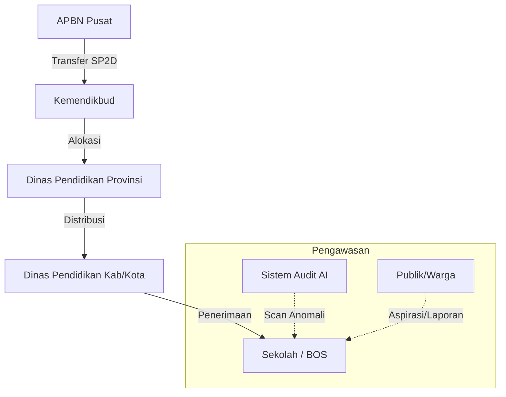

# 🏦 Transparansi Anggaran Pendidikan (Portal BOS Digital)
[](https://opensource.org/licenses/MIT)
[](https://nextjs.org/)
[](https://deepmind.google/technologies/gemini/)
## 🚀 Misi Proyek
Membangun sistem pengawasan anggaran pendidikan yang **end-to-end**, dari APBN Pusat hingga ke tangan sekolah, guna memastikan setiap rupiah sampai ke tujuannya tanpa dikorupsi. Platform ini memberikan visibilitas publik terhadap aliran dana dan audit otomatis berbasis AI terhadap kecurangan (markup/anomali).
---
## 🗺️ Fund Flow Architecture (Aliran Dana)
Sistem ini memecahkan masalah "dana gaib" dengan melacak rekonsiliasi angka di setiap level:

**Fitur Rekonsiliasi**: Jika Dana yang dialokasikan di Pusat tidak sama dengan yang diterima di Sekolah, sistem akan memberikan **! FLAG** (Anomali) secara otomatis untuk diperiksa oleh KPK/BPK.
---
## ✨ Fitur Utama (MVP)
### 1. 🔍 Audit Otomatis AI (Gemini Pro)
- Mendeteksi potensi **Markup Harga** secara instan.
- Memberikan skor risiko terhadap setiap transaksi sekolah.
- Analisis tren belanja sekolah dibandingkan dengan harga pasar rata-rata.
### 2. 📝 Input Presisi & Itemized
- Pencatatan transaksi bukan sekadar nominal total.
- Mendukung rincian: Satuan (Liter, Pcs, dll), Harga Satuan, Pajak (PPN/PPh), dan Ongkos Kirim.
- Membantu sekolah dalam pelaporan mandiri yang lebih akuntabel.
### 3. 🏛️ Portal Auditor (Pusat)
- Dashboard khusus untuk Kemendikbud/KPK/BPK untuk memantau sekolah dengan risiko tertinggi secara nasional.
- Peta persebaran anggaran per wilayah.
### 4. 👫 Transparansi Publik (Citizen Oversight)
- Forum diskusi publik di setiap dashboard sekolah.
- Fitur "Beri Bintang" (Apresiasi Warga) untuk sekolah yang transparan.
---
## 🛠️ Tech Stack
- **Frontend**: Next.js 15 (App Router), Tailwind CSS, Framer Motion.
- **Backend & DB**: Supabase (PostgreSQL), Row-Level Security (RLS).
- **Intelligence**: Google Gemini API (untuk audit AI).
- **Charts**: Recharts & Shadcn UI components.
---
## ⚙️ Cara Menjalankan Proyek
1. **Clone Repository**:
   ```bash
   git clone https://github.com/adimaryanto-stack/Transparansi-Anggaran-Pendidikan.git
   cd Transparansi-Anggaran-Pendidikan/apps/web-next
   ```
2. **Install Dependencies**:
   ```bash
   npm install
   ```
3. **Konfigurasi Environment**:
   Buat file `.env.local` dan isi dengan:
   ```env
   NEXT_PUBLIC_SUPABASE_URL=your_supabase_url
   NEXT_PUBLIC_SUPABASE_ANON_KEY=your_supabase_key
   GEMINI_API_KEY=your_gemini_api_key
   ```
4. **Jalankan Aplikasi**:
   ```bash
   npm run dev
   ```
---
## 📊 Roadmap & Planning
Proyek ini dikembangkan dalam beberapa fase:
- [x] **Fase 1**: Perancangan database & Auth (Supabase).
- [x] **Fase 2**: Dashboard Sekolah & Grafik Alokasi.
- [x] **Fase 3**: Integrasi AI Audit (Gemini) untuk deteksi markup.
- [x] **Fase 4**: Sistem Fund Flow Tracking (APBN ke Sekolah).
- [ ] **Fase 5**: Integrasi OCR (Scan Nota) otomatis untuk validasi bukti fisik.
---
## 🤝 Kontribusi
Aplikasi ini bersifat Open Source (MIT) sebagai bentuk kontribusi digital untuk pendidikan Indonesia yang lebih bersih.
Dibuat dengan ❤️ untuk Masa Depan Pendidikan Indonesia.
