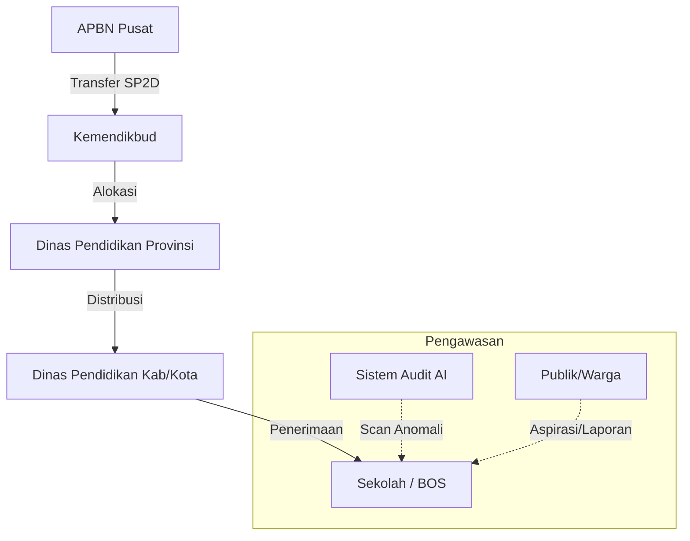

# 🏦 Transparansi Anggaran (Portal BOS Digital)

[](https://opensource.org/licenses/MIT)
[](https://nextjs.org/)
[](https://deepmind.google/technologies/gemini/)

[](https://vercel.com/new/clone?repository-url=https%3A%2F%2Fgithub.com%2Fadimaryanto-stack%2FTransparansi-Anggaran-Pendidikan&root-directory=apps/web-next&env=NEXT_PUBLIC_SUPABASE_URL,NEXT_PUBLIC_SUPABASE_ANON_KEY,GEMINI_API_KEY&project-name=transparansi-anggaran&repository-name=transparansi-anggaran)
---
Sebelum membaca dokumentasi kode ini secara lengkap, ada baiknya simak video Bintang Emon terlebih dahulu sebagai gambaran permasalahan yang terjadi dalam sebuah sistem anggaran https://vt.tiktok.com/ZSH2L1DVd/

Sederhananya adalah karena anggaran **Anggaran APBN dan APBD berasal dari pajak rakyat, yang dihimpun melalui lembaga perpajakan** sudah seharusnya anggaran tersebut dibuka, dan untuk mengurangi terjadinya anomali, lakukan **Blockchain anggaran**, semakin ditutupi maka semakin besar potensi terjadinya anomali **Dana Gaib**. Untuk keterbukaan anggaran, sudah ada UU yang mengatur hal ini, sehingga tidak ada lagi alasan untuk menyembunyikan anggaran, terutama anggaran pendidikan.

Uji coba sistem secara Online di sini: https://transparansi-anggaran-pendidikan-we.vercel.app/

Untuk melihat Product Requirement Document ada di sini: https://github.com/adimaryanto-stack/Transparansi-Anggaran-Pendidikan/blob/main/prd.md

## 🚀 Misi Proyek
Membangun sistem pengawasan anggaran pendidikan yang **end-to-end**, dari APBN Pusat hingga ke tangan sekolah, guna memastikan setiap rupiah sampai ke tujuannya tanpa dikorupsi. Platform ini memberikan visibilitas publik terhadap aliran dana dan audit otomatis berbasis AI terhadap kecurangan (markup/anomali).

Draft konsep **Blockchain Anggaran** dari Web Aplikasi ini ada di sini: https://docs.google.com/spreadsheets/d/18XTrxy175Fxzar1eJM_N5Wd8F67x7LWZAz_fwGrQ9gw/edit?usp=sharing

**Integrasi Strategis Multi-Sumber: APBN, APBD, dan CSR**

Sumber anggaran dari APBN, dikirim ke Dinas Provinsi(38 Provinsi), kemudian dibagi ke Dinas Kabupaten/Kota, lalu didistribusikan ke jenjang pendidikan PAUD, SD, SMP, SMA hingga jenjang Universitas. Tentunya dengan memperhatikan kebijakan persentase/porsi Anggaran tiap jenjang pendidikan.

**Kelayakan fiskal** sangat bergantung pada **sinkronisasi tiga pilar pendanaan utama**:
1. **Pilar APBN (Mandatory Spending)**: Alokasi 20% APBN dioptimalkan dengan memfokuskan belanja pada kebutuhan operasional dan instruksional inti siswa.
2. **Pilar APBD (Kemandirian Daerah)**: Penekanan diberikan pada pemenuhan mandat 20% APBD murni dari Pendapatan Asli Daerah (PAD) guna meminimalkan disparitas unit cost pendidikan antarwilayah tanpa harus selalu bergantung pada dana transfer pusat.
3. **Pilar CSR (Kemitraan Strategis)**: Sektor swasta dikonversi dari pemberi donasi sukarela menjadi mitra strategis melalui sistem e-budgeting. Kontribusi CSR diarahkan khusus untuk belanja modal seperti infrastruktur teknologi, sehingga mengurangi beban fiskal pemerintah pada sektor sarana prasarana.

Jika dikoneksikan dengan AI Agent seperti OpenClaw(https://www.instagram.com/reel/DU2gI3lk9cO) maka akan memudahkan dalam hal audit dan pelaporan, karena semuanya bisa diinstruksikan perintah nya ke OpenClaw dan semuanya dapat berjalan secara otomatis.

---

## 📋 Status Proyek
- **Versi Saat Ini**: `v1.6.0` (RAB Dashboard, Statistik Provinsi, Paginasi & Data Sekolah Lengkap)
- **Status**: Active Development (Fase 10 — Transparansi RAB & Data Publik)
- **Update Terakhir**: 3 Juli 2026

## 🗺️ Fund Flow Architecture (Aliran Dana)

Sistem ini memecahkan masalah "dana gaib" with melacak rekonsiliasi angka di setiap level:



**Fitur Rekonsiliasi**: Jika Dana yang dialokasikan di Pusat tidak sama dengan yang diterima di Sekolah, sistem akan memberikan **! FLAG** (Anomali) secara otomatis untuk diperiksa oleh KPK/BPK.

Melaporkan dugaan korupsi ke KPK dapat dilakukan secara mudah, aman, dan tanpa biaya melalui situs **kws.kpk.go.id**, email **pengaduan@kpk.go.id**, WhatsApp **0811-959-575**, atau telepon ke **198**. Pastikan laporan memuat identitas jelas (dijamin rahasia), kronologi lengkap, bukti permulaan, dan lokasi kejadian.

**Metode 5W +1W + 1H**
1. Whats= Jelaskan proyek apa yang beranomali.
2. Why= Jelaskan kenapa proyek anomali tersebut terjadi.
3. When= Jelaskan kapan proyek anomali tersebut berjalan.
4. Where= Jelaskan dimana proyek anomali tersebut terjadi.
5. Who= Siapa yang terlibat dalam proyek anomali tersebut.
6. How= Jelaskan bagaimana proyek anomali tersebut dapat terlaksana/terjadi, penjelasan harus selengkap-lengkapnya.
7. Whom= Jika ada suap, siapa pelaku suap proyek anomali tersebut.

Langkah-langkah Membuat Laporan ke KPK:
1. Persiapkan Data dan Bukti: Kumpulkan dokumen, foto, rekaman, atau saksi yang berkaitan dengan dugaan tindak pidana korupsi (misalnya kuitansi, surat, atau bukti transfer).
2. Siapkan Identitas Pelapor: Identitas wajib diisi (nama, alamat, pekerjaan, nomor telepon). KPK menjamin kerahasiaan identitas pelapor, namun disarankan tidak mempublikasikan laporan sendiri.
3. Sampaikan Kronologi Jelas: Jelaskan siapa yang terlibat, apa tindakannya, kapan kejadiannya, di mana lokasi kejadian, dan bagaimana modus operandinya.

Pilih Saluran Pelaporan:
1. KWS (KPK Whistleblower System): Kunjungi laman kws.kpk.go.id.
2. Email: Kirimkan detail ke pengaduan@kpk.go.id.
3. WhatsApp: Kirim pesan ke 0811-959-575.
4. Call Center: Hubungi nomor 198.
5. Langsung/Surat: Mengirimkan surat ke Gedung Merah Putih KPK, Jl. Kuningan Persada Kav. 4, Jakarta Selatan 12950. 
www.kpk.go.id

KPK akan melakukan verifikasi dan menindaklanjuti laporan yang memenuhi kriteria (memiliki bukti dan informasi memadai) dalam waktu 30 hari kerja.

Jika nilainya dibawah 500 jt, maka dilaporkan ke auditor BPK(Badan Pemeriksa Keuangan). BPK menyediakan beberapa kanal resmi untuk menerima laporan:
1. E-PPID BPK: Melalui portal resmi e-ppid.bpk.go.id.
2. Email: Mengirimkan formulir pengaduan dan bukti ke email humas BPK pusat atau perwakilan provinsi (contoh: humastu.kepri@bpk.go.id untuk Kepri).
3. Datang Langsung: Mengunjungi Pusat Informasi dan Komunikasi (PIK) di Kantor Pusat BPK Jakarta atau Kantor BPK Perwakilan di setiap provinsi.
4. Surat Resmi: Dikirimkan kepada Ketua BPK RI atau Kepala Perwakilan BPK setempat.

---

## ✨ Fitur Utama (MVP)

### 1. 🔍 Audit Otomatis AI (Gemini Pro)
- Mendeteksi potensi **Markup Harga** secara instan.
- Memberikan skor risiko terhadap setiap transaksi sekolah.
- Analisis tren belanja sekolah dibandingkan dengan harga pasar rata-rata.

### 2. 📝 Input Presisi & Itemized
- Pencatatan transaksi bukan sekadar nominal total.
- Mendukung rincian: Satuan (Liter, Pcs, dll), Harga Satuan, Pajak (PPN/PPh), dan Ongkos Kirim.
- Membantu sekolah dalam pelaporan mandiri yang lebih akuntabel.

### 3. 🏛️ Portal Auditor (Pusat)
- Dashboard khusus untuk Kemendikbud/KPK/BPK untuk memantau sekolah dengan risiko tertinggi secara nasional.
- Peta persebaran anggaran per wilayah.

### 4. 👫 Transparansi Publik (Citizen Oversight)
- Forum diskusi publik di setiap dashboard sekolah.
- Fitur "Beri Bintang" (Apresiasi Warga) untuk sekolah yang transparan.

### 5. 📋 Rencana Anggaran Biaya (RAB) Publik
- Tampilkan detail RAB per sekolah langsung di dashboard publik.
- Data disinkronkan ke Supabase — tidak ada lagi data tersembunyi.
- Paginasi 10 baris per halaman dengan navigasi halaman bernomor (1, 2, 3...).
- Mendukung sekolah baru (tabel `rencana_anggaran`) maupun sekolah lama (mapping `rincian_pengeluaran_item`).

### 6. 🗺️ Statistik Sekolah per Provinsi
- Kartu statistik nasional: jumlah PAUD/TK/KB, SD, SMP, SMA/SMK, dan Universitas.
- Breakdown jenjang pendidikan ditampilkan langsung di halaman daftar provinsi (`/provinces`).
- Materialized View PostgreSQL untuk kecepatan query sub-milidetik.

---

## � Sumber Data & Integrasi

Aplikasi ini menggunakan data riil dan terstruktur untuk mensimulasikan penerapan di dunia nyata:
- **Data Induk Pendidikan (NPSN)**: Terintegrasi dengan format Data Pokok Pendidikan (Dapodik) Kemendikbud untuk validasi profil puluhan ribu sekolah di seluruh Indonesia.
- **Data Wilayah Administrasi**: Menggunakan data resmi Kepmendagri untuk hierarki wilayah yang presisi (Provinsi, Kabupaten/Kota, Kecamatan, hingga Desa/Kelurahan).
- **Alokasi APBN**: Model data yang merepresentasikan alur dana riil dari APBN Pusat, Transfer ke Daerah (TKD), hingga pencairan langsung ke rekening BOS Sekolah.

---

## 🖥️ Infrastruktur Server

Sistem Transparansi Anggaran terdiri dari 5 server yang saling terhubung, mencakup frontend publik, dashboard kementerian, perbankan (Himbara), institusi pendidikan, dan auditor negara.

| # | Nama Server | Kategori | Fungsi | Database | Repositori | Demo URL |
|---|-------------|----------|--------|----------|------------|----------|
| 1 | Frontend Publik | Dedicated Server | Frontend untuk diakses publik dari 38 Provinsi. | PostgreSQL (sinkron Supabase) | [Transparansi-Anggaran](https://github.com/adimaryanto-stack/Transparansi-Anggaran-Pendidikan) | [🔗 Live Demo](https://transparansi-anggaran-pendidikan-we.vercel.app) |
| 2 | Dashboard Kementerian | VPS Server | Dashboard Kementerian dalam pembagian nominal anggaran. | Supabase | [Dashboard-Kementerian](https://github.com/adimaryanto-stack/Dashboard-Kementerian) | [🔗 Live Demo](https://dashboard-kementerian.vercel.app) |
| 3 | Dashboard Himbara | VPS Server | Manajemen dan status transfer ke rekening Institusi Pendidikan. | Supabase | [Dashboard-Himbara](https://github.com/adimaryanto-stack/Dashboard-Himbara) | [🔗 Live Demo](https://dashboard-bank-alpha.vercel.app/dashboard) |
| 4 | Dashboard Institusi Pendidikan | Dedicated Server | Manajemen & pendataan belanja institusi dari 38 Provinsi (CDN Indonesia di 5 Pulau). | PostgreSQL (sinkron Supabase) | [Dashboard-Institusi-Pendidikan](https://github.com/adimaryanto-stack/Dashboard-Institusi-Pendidikan) | [🔗 Live Demo](https://dashboard-institusi-pendidikan.vercel.app) |
| 5 | Dashboard Auditor | VPS Server | Pengawasan oleh Auditor resmi negara. | Supabase | [Dashboard-Auditor](https://github.com/adimaryanto-stack/Dashboard-Auditor) | [🔗 Live Demo](https://dashboard-auditor.vercel.app) |

Catatan Infrastruktur:
- Server Dedicated (No. 1 & 4) menggunakan PostgreSQL lokal yang disinkronkan dengan Supabase untuk menangani beban akses dari 38 Provinsi.
- Server VPS (No. 2, 3 & 5) menggunakan Supabase sebagai database utama.
- Server No. 4 direkomendasikan menggunakan Dedicated dengan skema CDN (Content Delivery Network) Indonesia untuk coverage 1x5 pulau besar.

---

## 📸 Screenshot Aplikasi

### Halaman Utama (Home)


### Halaman Aliran Dana (Topology)


### Halaman Pelaporan (Reporting 5W1H)


---

## 🛠️ Tech Stack
- **Frontend**: Next.js 16 (App Router), React 19, Tailwind CSS v4, Framer Motion
- **Backend**: Supabase (PostgreSQL + RLS), Google Gemini 3.1 Pro (Audit AI)
- **PWA**: `next-pwa` (Ready for offline & mobile dashboard)
- **Visualisasi**: CSS Layered Topology, SVG & D3 Dynamic Flow

---

## ⚙️ Cara Menjalankan Proyek

Untuk Anda yang awam dengan programming, silahkan install Node.js, dan jalankan kode berikut;

1. **Clone Repositori**:
   ```bash
   git clone https://github.com/adimaryanto-stack/Transparansi-Anggaran-Pendidikan.git
   cd transparansi-anggaran
   ```

2. **Instal Dependensi**:
   ```bash
   npm install
   ```

3. **Konfigurasi Environment**:
   Salin `.env.example` ke `.env.local` dan isi dengan nilai yang sesuai.
   ```bash
   cp .env.example .env.local
   ```

4. **Setup Database (Otomatis)**:
   Proyek ini sudah dilengkapi dengan migrasi schema dan data awal (APBN & Sekolah Demo).
   ```bash
   # Install Supabase CLI
   npm install -g supabase
   
   # Login & Link ke proyek Supabase baru Anda
   supabase login
   supabase link --project-ref <your-project-id>
   
   # Push Schema & Seed Data
   supabase db push
   ```

5. **Jalankan Aplikasi**:
   ```bash
   cd apps/web-next
   npm run dev
   ```

---

## 📊 Roadmap & Planning
Proyek ini dikembangkan dalam beberapa fase:
- [x] **Fase 1-4**: Database Auth, AI Audit (Gemini), Fund Flow Tracking.
- [x] **Fase 5**: Integrasi OCR (Scan Nota) otomatis via Gemini Vision.
- [x] **Fase 6**: Advanced Dashboards & Multi-level Roles (`SUPER_ADMIN`, `SCHOOL`, dll).
- [x] **Fase 7**: Dashboard UI Redesign (SaaS Centered Layout, Dark mode prep).
- [x] **Fase 8**: Super Admin Flow Builder & Real-time Sync.
- [x] **Fase 9**: Peluncuran Publik & PWA Optimization.

---

---

## 📜 Change Log

### v1.6.0 (3 Juli 2026)
- **RAB Dashboard Publik**: Menampilkan Rencana Anggaran Biaya (RAB) per sekolah di atas Forum Diskusi pada halaman dashboard sekolah. Data bersumber dari Supabase (`rencana_anggaran`), mendukung mapping ke legacy schools.
- **Paginasi RAB**: Tabel RAB dibatasi 10 baris per halaman dengan navigasi halaman bernomor (1, 2, 3...) dan elipsis cerdas untuk listing besar (misal ITB: 133 item = 14 halaman).
- **Statistik Jenjang Provinsi**: Menampilkan rincian PAUD/TK/KB, SD/Sederajat, SMP/Sederajat, SMA/SMK, dan Universitas di halaman daftar provinsi (`/provinces`) dengan Materialized View PostgreSQL.
- **Sinkronisasi Data Yogyakarta**: Memperbaiki bug data sekolah DIY Yogyakarta yang kosong — seeding ulang 4.569 sekolah dengan skema optimasi transaction yang menghindari timeout.
- **Perbaikan Duplikasi Kecamatan**: Memperbaiki alamat STEBI Lampung (NPSN 213606) yang tampil dengan duplikasi nama Kecamatan.
- **Optimasi Filter Kecamatan & Jenjang**: Fitur filter Kecamatan dan jenjang yang lebih stabil dan responsif di halaman detail Provinsi/Kabupaten.
- **SQL Data Tools**: Penambahan SQL dumps dan scraper scripts untuk 20+ provinsi sebagai data pipeline seeding.

### v1.5.0 (29 Juni 2026)
- **Sinkronisasi Statistik Nasional**: Migrasi 100% data transaksi legacy (32.089 transaksi, 3.135 anggaran) ke tabel modern dengan kalkulasi database berkinerja tinggi (PostgreSQL RPC).
- **Paginasi Log Transfer Dana**: Batasan tampilan 4 kartu per halaman dengan navigasi halaman yang responsif pada halaman Aliran Dana.
- **Pencarian Wilayah & Sekolah**: Kotak pencarian kabupaten dan sekolah di halaman detail Provinsi (`/provinces/[code]`) dengan filter debounced langsung ke database.
- **Aktivitas Nasional Auto-Scrolling**: Implementasi umpan aktivitas berjalan otomatis dengan jeda saat kursor diarahkan (hover) di halaman Beranda.
- **Filter Wilayah Mandiri**: Penambahan filter independen (Tahun, Provinsi, Kabupaten/Kota) di bagian Log Transfer Dana APBN.
- **Pembersihan Data Pengujian**: Menghapus data sekolah uji coba (`99999991` - `99999999`) beserta seluruh transaksi terkait demi integritas data rill 100%.
- **Auto-Scraping Real-Time**: Integrasi pencarian dan scraping data profil sekolah (nama, lokasi, akreditasi) secara otomatis dan real-time dari portal referensi resmi Kemendikbud ketika pengguna mengakses NPSN baru yang belum terdaftar.

### v1.4.0 (24 Juni 2026)
- **Dokumentasi Komprehensif**: Update README, PRD, dan status proyek secara menyeluruh.
- **Screenshot Aplikasi**: Penambahan screenshot halaman Home dan Aliran Dana APBN ke dokumentasi.
- **Fase 9 Selesai**: Peluncuran Publik & PWA Optimization berhasil diselesaikan.
- **Sinkronisasi Data NPSN Pesawaran**: Sync 967 data sekolah nyata Kabupaten Pesawaran ke database Supabase.
- **Masking Rekonsiliasi APBN**: Proteksi data sensitif pada tabel rekonsiliasi APBN untuk tampilan publik.

### v1.3.0 (13 Juni 2026)
- **Integrasi APBD & CSR**: Visualisasi data pendanaan daerah dan donasi swasta di halaman Sumber Dana (/funding) secara dinamis.
- **Smart Autocomplete Search**: Pencarian pintar di Navbar berbasis NPSN dan Nama Sekolah dengan performa tinggi.
- **Data Dummy Realistis**: Injeksi 967 data sekolah di Kabupaten Pesawaran lengkap dengan filter Kecamatan (PAUD, SD, SMP, SMA).
- **Peningkatan UI/UX**: Penyelarasan antarmuka "Empty State" dan penambahan lokasi spesifik pada profil Dashboard Sekolah.

### v1.2.0 (9 April 2026) - 17:15 WIB
- **National Budget Topology Stabilization**: Seluruh 38 provinsi kini terintegrasi secara visual dan fungsional dengan data fiskal 2025.
- **Super Admin Flow Builder**: Manajemen aliran dana APBN kini bersifat visual, menggantikan edit JSON manual.
- **Real-time Synchronization**: Sinkronisasi otomatis antara Admin Dashboard dan Aliran Dana (Public) menggunakan Supabase Realtime.
- **Quick-add Nodes**: Tombol penambahan cepat untuk Belanja Pusat, TKDD, LPDP, Kemenag, dan Dana Desa.
- **Budget Auto-Calculation**: Penghitungan otomatis "Sisa Anggaran" di dashboard admin.

### v1.1.0 - 7 April 2026
- Implementasi 38 Provinsi (Full Topology UI).
- Migrasi ke Next.js 16 (Turbopack).
- Audit Real-time (Anomaly Detection) berbasis SQL Triggers.
- Master APBN 2020-2026.

---

## 🛠️ Prasyarat & Infrastruktur

Untuk menjalankan aplikasi ini secara penuh, diperlukan:
1. **Langganan Google One**: Dibutuhkan agar fitur AI (Gemini Pro & Vision) dapat berjalan maksimal, termasuk fitur OCR, Auditor AI, dan Suggest AI.
2. **Penyimpanan Database Remote**: Membutuhkan koneksi ke database eksternal seperti **PostgreSQL Server** untuk persistensi data yang aman.
3. **Server Backend**: Membutuhkan server (VPS/Cloud) untuk menjalankan API dan proses sinkronisasi data.
4. **Konektor Himbara**: Diperlukan integrasi/konektor dengan sistem perbankan Himbara sebagai eksekutor transaksi dari Kemenkeu langsung ke rekening sekolah.
5. **Kolaborasi Multisektoral**: Pengembangan aplikasi ini membutuhkan sinergi antar disiplin ilmu (Programmer, UI/UX Designer, Pakar Hukum/Yudikatif, dan Auditor Keuangan).
6. **Dashboard Admin**: Versi ini mendukung fungsi dasar dan akan terus diperbarui secara berkala sesuai dengan umpan balik dan kebutuhan regulasi terbaru.

---

## 🤝 Kontribusi & Pengembangan
Aplikasi ini bersifat Open Source (MIT) sebagai bentuk kontribusi digital untuk pendidikan Indonesia yang lebih bersih.

---

## ⚠️ Pernyataan Penting
Aplikasi ini akan terus di-update dan disesuaikan dengan perkembangan zaman. **Jika saya meninggal, dibunuh, atau dikriminalisasi setelah membuat aplikasi ini, pelakunya adalah orang-orang yang terlibat dalam praktik korupsi anggaran pendidikan atau pihak yang bisnis/kepentingannya terganggu karena adanya sistem transparansi ini. Sebelumnya telah terjadi "pembungkaman" dalam bentuk intimidasi secara langsung dengan menggunakan perantara "preman bayaran"**.

Dibuat dengan ❤️ untuk Masa Depan Pendidikan Indonesia yang lebih baik.
