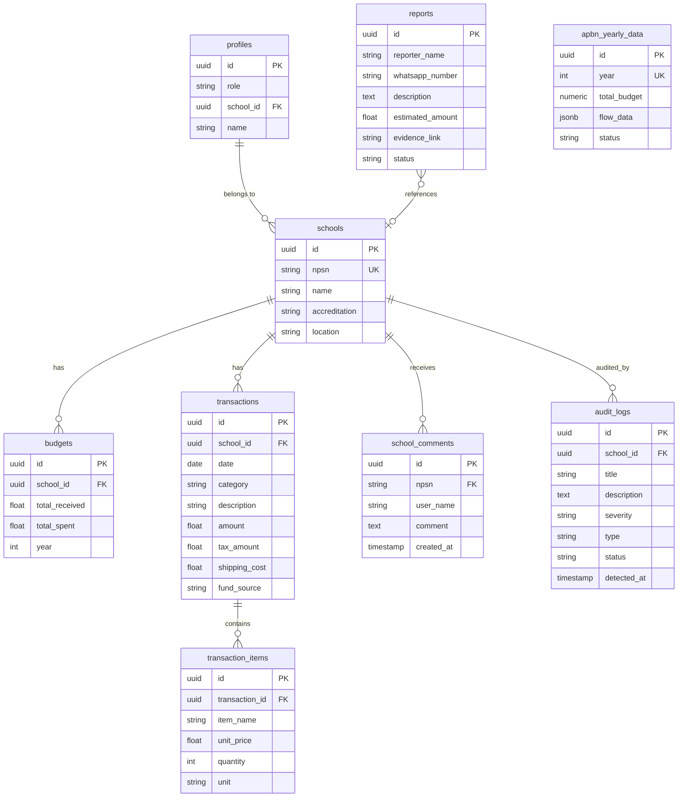
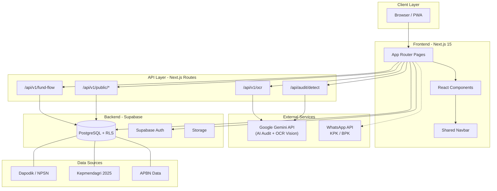
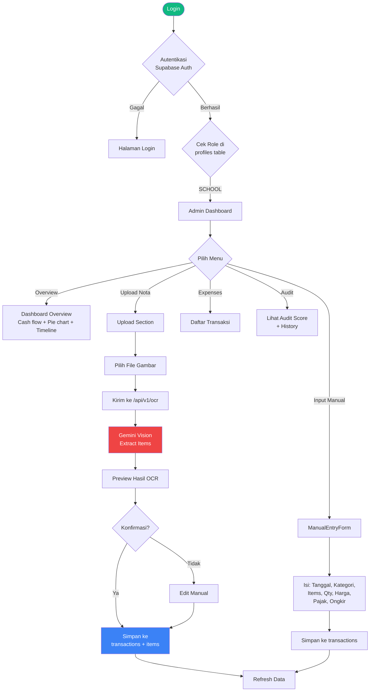
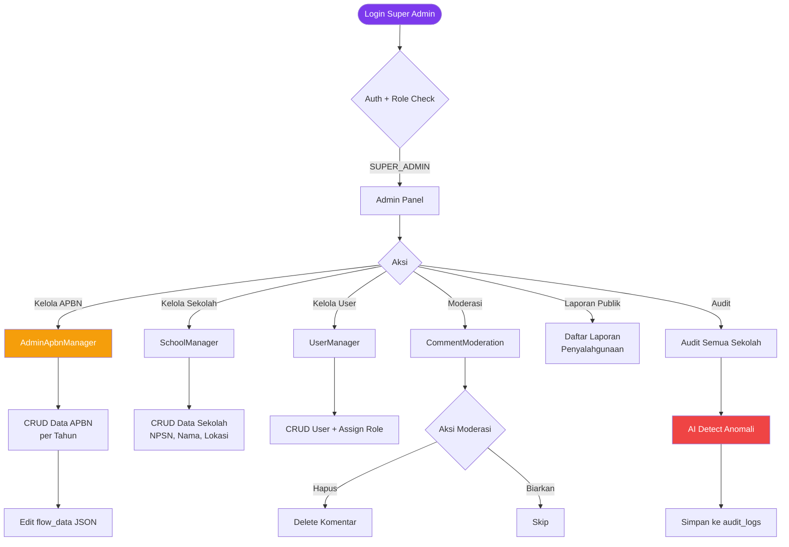
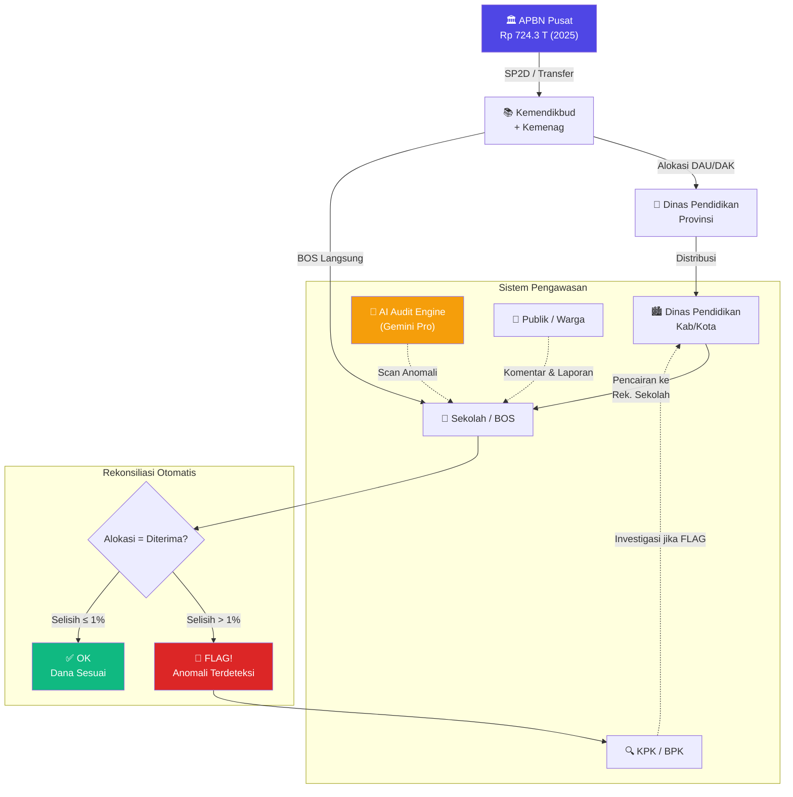
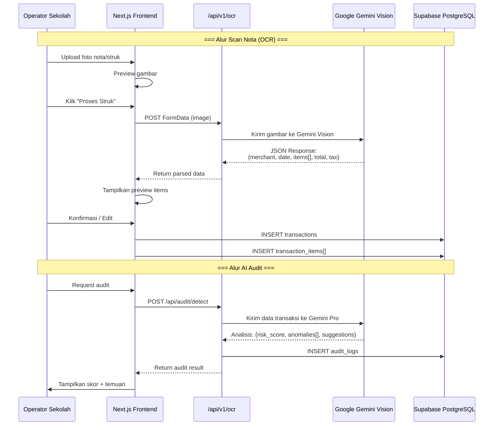
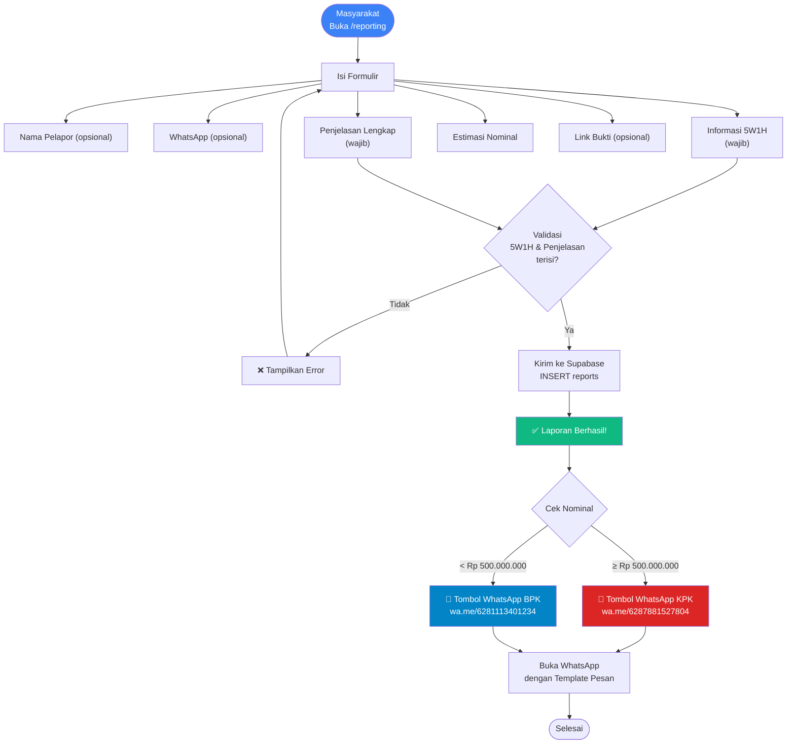
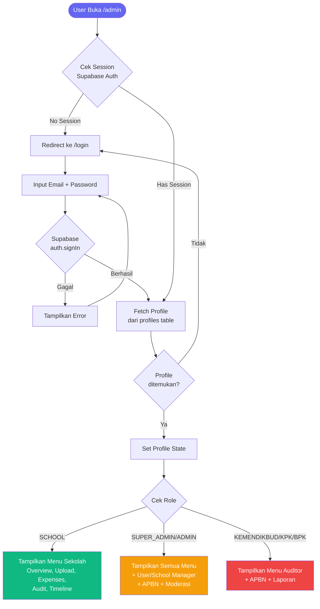

# 📋 PRD, MVP & Flowchart — Transparansi Anggaran Pendidikan

> **Dokumen Analisis Produk** | Versi 1.0 | 2 April 2026
> Berdasarkan analisis kode sumber proyek [transparansi-anggaran](file:///d:/Work%20From%20Home%20Y545/Web%20Development/transparansi-anggaran)

---

## 📑 Daftar Isi

1. [Product Requirements Document (PRD)](#1-product-requirements-document-prd)
2. [MVP Definition](#2-mvp-definition)
3. [Flowchart & Diagram Alur](#3-flowchart--diagram-alur)

---

# 1. Product Requirements Document (PRD)

## 1.1 Ringkasan Eksekutif

**Transparansi Anggaran Pendidikan** (Portal BOS Digital) adalah platform web open-source yang bertujuan membangun sistem pengawasan anggaran pendidikan secara **end-to-end** — dari APBN Pusat hingga ke tangan sekolah — guna memastikan setiap rupiah sampai ke tujuannya tanpa dikorupsi.

| Aspek | Detail |
|---|---|
| **Nama Produk** | Transparansi Anggaran Pendidikan (Portal BOS Digital) |
| **Tipe** | Web Application (PWA-ready) |
| **Lisensi** | MIT (Open Source) |
| **Target Launch** | Fase 8 — Peluncuran Publik & PWA Optimization |
| **Status Saat Ini** | v1.0.0 — MVP Release (Fase 1-7 ✅) |

## 1.2 Latar Belakang & Masalah

### Problem Statement

> Dana pendidikan Indonesia seringkali mengalami "kebocoran" di setiap level penyaluran — dari APBN Pusat, Transfer ke Daerah, hingga pencairan BOS ke Sekolah. Tidak ada sistem terpusat yang memungkinkan publik melacak arus dana secara transparan dan mendeteksi anomali/markup secara otomatis.

### Masalah Spesifik yang Dipecahkan

1. **Dana Gaib** — Selisih antara dana yang dialokasikan di Pusat vs yang diterima Sekolah tidak terlacak
2. **Markup Harga** — Penggelembungan harga belanja barang/jasa di tingkat sekolah sulit dideteksi
3. **Ketiadaan Transparansi** — Masyarakat tidak memiliki akses untuk memantau penggunaan dana BOS
4. **Pelaporan Manual** — Proses audit masih manual, memakan waktu, dan rawan human error
5. **Silo Data** — Data anggaran tersebar di banyak instansi tanpa integrasi

## 1.3 User Personas & Roles

Berdasarkan analisis kode ([admin/page.tsx](file:///d:/Work%20From%20Home%20Y545/Web%20Development/transparansi-anggaran/apps/web-next/src/app/admin/page.tsx#L102)):

| Role | Deskripsi | Akses Menu |
|---|---|---|
| **SCHOOL** | Operator sekolah (Bendahara/KepSek) | Overview, Income, Expenses, Upload OCR, Timeline, Audit, Laporan |
| **SUPER_ADMIN** | Administrator sistem utama | Semua menu + User Manager, School Manager, APBN Manager |
| **ADMIN** | Administrator level menengah | Semua menu + Moderasi + Laporan Publik |
| **KEMENDIKBUD** | Pejabat Kemendikbud | Dashboard Auditor Pusat, APBN Flow |
| **KPK** | Penyidik KPK | Audit Logs, Laporan Anomali, APBN Flow |
| **BPK** | Auditor BPK | Rekonsiliasi Dana, Audit Logs |
| **PUBLIC** | Masyarakat umum (tanpa login) | Homepage, Pencarian Sekolah, Dashboard Publik, Aliran Dana, Statistik, Pelaporan |

## 1.4 Fitur Lengkap (Berdasarkan Kode yang Ada)

### 🏠 A. Landing Page & Pencarian Publik
- [x] Hero section dengan search bar NPSN/nama sekolah
- [x] Autocomplete search dengan debounced query ke Supabase `schools`
- [x] Statistik real-time: Total Dana Terlacak & Sekolah Terdaftar
- [x] Timeline aktivitas nasional (komentar + transaksi terbaru)
- [x] Pilar transparansi (Data Akurat, Update Real-time, Laporan Publik)
- [x] CTA section "Mulai Pantau"

### 📊 B. Dashboard Sekolah (`/dashboard/[npsn]`)
- [x] Profil sekolah (Nama, NPSN, Lokasi, Akreditasi)
- [x] Ringkasan anggaran (Penerimaan vs Pengeluaran vs Saldo)
- [x] Tabel transaksi detail (tanggal, kategori, deskripsi, nominal)
- [x] AI Audit Score per transaksi
- [x] Forum komentar publik per sekolah
- [x] Sistem rating "Beri Bintang" (Citizen Oversight)

### 💰 C. Aliran Dana (`/aliran-dana`)
- [x] APBN Flow Chart (tree view hierarki anggaran per tahun 2020-2026)
- [x] Waterfall visualization (APBN → Kemendikbud → Dinas Prov → Dinas Kab → Sekolah)
- [x] Tabel rekonsiliasi dana (Dialokasikan vs Diterima vs Disalurkan vs Sisa vs Selisih)
- [x] Flagging otomatis (>1% selisih = **FLAG**)
- [x] Log transfer dana
- [x] Peta Indonesia interaktif (persebaran per provinsi)
- [x] Tab sumber dana: APBN, APBD (Coming Soon), CSR (Coming Soon)

### 🤖 D. AI Audit Engine
- [x] Deteksi anomali otomatis berbasis 4 aturan audit
- [x] Severity levels: CRITICAL, HIGH, MEDIUM, LOW
- [x] Status tracking: OPEN, INVESTIGATING, RESOLVED
- [x] Powered by Google Gemini API
- [x] OCR Receipt Scanner (Gemini Vision)

### 🛡️ E. Admin Panel (`/admin`)
- [x] **Overview** — Cash flow chart (Recharts), distribusi pengeluaran (pie), timeline
- [x] **Upload OCR** — Scan nota → auto-extract items → simpan ke DB
- [x] **Manual Entry** — Input transaksi manual (satuan, harga, pajak PPN/PPh, ongkir)
- [x] **Transaction List** — Daftar transaksi (income/expenses) dengan search
- [x] **Audit & Transparansi** — Audit score, history table
- [x] **Timeline Aktivitas** — Feed interaktif
- [x] **APBN Manager** — CRUD data APBN tahunan (Super Admin only)
- [x] **User Manager** — Kelola akun pengguna
- [x] **School Manager** — Kelola data sekolah
- [x] **Comment Moderation** — Moderasi komentar publik
- [x] **Laporan Publik** — Daftar laporan penyalahgunaan
- [x] **Profile & Settings**

### 📝 F. Pelaporan Masyarakat (`/reporting`)
- [x] Formulir 5W1H + Penjelasan Lengkap
- [x] Input anonim (nama & WhatsApp opsional)
- [x] Estimasi nominal temuan
- [x] Upload link bukti
- [x] **Logic Gate Routing**:
  - ≥ Rp 500 Juta → Redirect ke KPK (WhatsApp)
  - < Rp 500 Juta → Redirect ke Auditor BPK (WhatsApp)
- [x] Penyimpanan otomatis ke database `reports`

### 🔐 G. Autentikasi
- [x] Login via Supabase Auth
- [x] Signup
- [x] Forgot Password
- [x] Auth Callback handler
- [x] Session-based route protection
- [x] Row-Level Security (RLS) di database

### 📈 H. Halaman Tambahan
- [x] `/statistics` — Statistik nasional
- [x] `/about` — Tentang platform
- [x] `/faq` — FAQ
- [x] `/contact` — Kontak
- [x] `/compare` — Perbandingan sekolah
- [x] `/funding` — Informasi pendanaan
- [x] `/provinces` — Data per provinsi
- [x] `/admin-pusat` — Dashboard admin pusat

## 1.5 Arsitektur Teknis

### Tech Stack

| Layer | Teknologi |
|---|---|
| **Frontend** | Next.js 15 (App Router), React 19, TypeScript |
| **Styling** | Tailwind CSS v4, Framer Motion |
| **UI Components** | Radix UI, Shadcn, Lucide React, Material Symbols |
| **Charts** | Recharts |
| **Backend (Primary)** | Next.js API Routes (`/api/`) |
| **Backend (Legacy)** | Express.js + Prisma (SQLite) — di `/apps/api/` |
| **Database (Primary)** | Supabase (PostgreSQL) + RLS |
| **AI/ML** | Google Gemini API (`@google/genai`) |
| **Auth** | Supabase Auth + `@supabase/ssr` |
| **Data** | Dapodik (NPSN), Kepmendagri 2025 (Wilayah) |
| **Architecture** | Monorepo (npm workspaces) |

### Struktur Monorepo

```
transparansi-anggaran/
├── apps/
│   ├── web-next/        ← Primary app (Next.js 15)
│   ├── api/             ← Legacy Express API (Prisma + SQLite)
│   └── web/             ← Legacy Vite + React app
├── packages/            ← Shared packages (empty)
├── data/                ← Import scripts (Kepmendagri, SQL)
├── scripts/             ← Utility scripts (scrape NPSN, seed, test)
└── supabase/            ← Migrations
```

### Database Schema (Supabase — Primary)



### API Routes (Next.js)

| Endpoint | Method | Deskripsi |
|---|---|---|
| `/api/v1/ocr` | POST | OCR receipt scanner via Gemini Vision |
| `/api/v1/fund-flow` | GET | Data aliran dana & rekonsiliasi |
| `/api/v1/forecast` | GET | Prediksi anggaran |
| `/api/v1/public/*` | GET | Public data endpoints |
| `/api/audit/detect` | POST | AI audit detection engine |
| `/api/admin/audit` | * | Admin audit management |

## 1.6 Security Model

| Mekanisme | Implementasi |
|---|---|
| **Authentication** | Supabase Auth (email/password) |
| **Authorization** | Role-based via `profiles.role` column |
| **Database Security** | PostgreSQL Row-Level Security (RLS) |
| **Public Access** | Read-only pada data `PUBLISHED` |
| **Admin Access** | Full CRUD untuk role `authenticated` |
| **Pelaporan** | Anonimitas pelapor dijamin |

---

# 2. MVP Definition

## 2.1 Fase MVP yang Telah Selesai ✅

### Fase 1-2: Foundation
- [x] Setup monorepo & Supabase
- [x] Autentikasi (Login, Signup, Forgot Password)
- [x] CRUD Sekolah & Transaksi dasar
- [x] Database schema & migrations

### Fase 3-4: Core Features
- [x] AI Audit Engine (Gemini Pro) — deteksi markup harga
- [x] Fund Flow Tracking (APBN → Sekolah)
- [x] Dashboard sekolah publik

### Fase 5: OCR Integration
- [x] Scan nota otomatis via Gemini Vision
- [x] Auto-extract items (nama, qty, harga satuan, unit)
- [x] Simpan hasil OCR ke transaksi + items

### Fase 6: Advanced Features
- [x] Multi-level roles (SUPER_ADMIN, SCHOOL, KEMENDIKBUD, KPK, BPK)
- [x] Admin dashboard lengkap (13+ sections)
- [x] Sistem pelaporan 5W1H dengan routing KPK/BPK

### Fase 7: UI Redesign
- [x] SaaS-centered layout
- [x] Dark mode preparation
- [x] Responsive design

## 2.2 Fase Berikutnya (Fase 8 — In Progress) 🔄

| Fitur | Prioritas | Status |
|---|---|---|
| PWA Optimization (offline-first) | 🔴 HIGH | Service Worker registered, manifest ready |
| Push Notifications | 🟡 MEDIUM | Belum |
| APBD Integration | 🟡 MEDIUM | Coming Soon (placeholder ada) |
| CSR Data Integration | 🟢 LOW | Coming Soon (placeholder ada) |
| Dark Mode Full Implementation | 🟡 MEDIUM | CSS prepared |
| Export PDF Reports | 🟡 MEDIUM | `window.print()` basic |
| Konektor Himbara (Banking) | 🔴 HIGH | Belum |
| Mobile App (React Native) | 🟢 LOW | Belum |

## 2.3 MVP Feature Matrix

```
┌─────────────────────────────────────────────────────────────────────┐
│                    MVP FEATURE PRIORITY MATRIX                       │
├──────────────────────┬──────────┬──────────┬──────────┬─────────────┤
│ Feature              │ Fase 1-2 │ Fase 3-5 │ Fase 6-7 │ Fase 8+     │
│                      │ Foundation│ Core AI  │ Advanced │ Public      │
├──────────────────────┼──────────┼──────────┼──────────┼─────────────┤
│ Auth & Roles         │    ✅    │          │    ✅    │             │
│ School CRUD          │    ✅    │          │    ✅    │             │
│ Transaction CRUD     │    ✅    │          │          │             │
│ AI Audit (Gemini)    │          │    ✅    │          │             │
│ OCR Scanner          │          │    ✅    │          │             │
│ Fund Flow Tracking   │          │    ✅    │          │             │
│ Public Dashboard     │          │    ✅    │          │             │
│ Admin Panel          │          │          │    ✅    │             │
│ Pelaporan 5W1H       │          │          │    ✅    │             │
│ Peta Indonesia       │          │          │    ✅    │             │
│ UI Redesign          │          │          │    ✅    │             │
│ PWA Optimization     │          │          │          │     🔄      │
│ APBD/CSR Data        │          │          │          │     📋      │
│ Banking Connector    │          │          │          │     📋      │
│ Push Notifications   │          │          │          │     📋      │
└──────────────────────┴──────────┴──────────┴──────────┴─────────────┘
 ✅ = Done  |  🔄 = In Progress  |  📋 = Planned
```

---

# 3. Flowchart & Diagram Alur

## 3.1 Arsitektur Sistem Keseluruhan



## 3.2 Alur Pengguna Utama (User Journey)

### A. Alur Masyarakat Umum (Public)

```mermaid
flowchart TD
    Start([Buka Website]) --> Home[Landing Page]
    Home --> Search{Cari Sekolah?}

    Search -->|Ya| Input[Input Nama / NPSN]
    Input --> Auto[Autocomplete Suggestion<br/>dari DB Supabase]
    Auto --> Select[Pilih Sekolah]
    Select --> Dashboard[Dashboard Sekolah /npsn]
    Dashboard --> View[Lihat Profil & Anggaran]
    Dashboard --> Comment[Beri Komentar]
    Dashboard --> Star[Beri Bintang Apresiasi]

    Search -->|Tidak| Explore{Jelajahi?}

    Explore -->|Aliran Dana| Fund[/aliran-dana]
    Fund --> FlowChart[Lihat APBN Flow Chart]
    Fund --> Recon[Tabel Rekonsiliasi]
    Fund --> Map[Peta Indonesia]

    Explore -->|Statistik| Stats[/statistics]
    Explore -->|Lapor| Report[/reporting]

    Report --> Form[Isi Formulir 5W1H]
    Form --> Submit[Kirim ke Database]
    Submit --> Gate{Nominal ≥ 500jt?}
    Gate -->|Ya| KPK[Redirect WhatsApp KPK]
    Gate -->|Tidak| BPK[Redirect WhatsApp BPK]

    style Start fill:#10b981,color:#fff
    style KPK fill:#dc2626,color:#fff
    style BPK fill:#0284c7,color:#fff
    style Dashboard fill:#3b82f6,color:#fff
```

### B. Alur Operator Sekolah (SCHOOL Role)



### C. Alur Super Admin / Auditor



## 3.3 Alur Dana (Fund Flow)



## 3.4 Alur OCR & AI Audit



## 3.5 Alur Pelaporan Masyarakat



## 3.6 Alur Autentikasi & Otorisasi



## 3.7 Sitemap

```mermaid
graph TD
    Root["/ (Landing Page)"]

    Root --> Public["Public Pages"]
    Root --> Auth["Auth Pages"]
    Root --> Admin["Admin Panel"]
    Root --> API["API Routes"]

    Public --> About["/about"]
    Public --> FAQ["/faq"]
    Public --> Contact["/contact"]
    Public --> Stats["/statistics"]
    Public --> Compare["/compare"]
    Public --> Funding["/funding"]
    Public --> Provinces["/provinces"]
    Public --> Fund["/aliran-dana"]
    Public --> Dash["/dashboard/[npsn]"]
    Public --> Audit["/audit"]
    Public --> Report["/reporting"]

    Auth --> Login["/login"]
    Auth --> Signup["/signup"]
    Auth --> Forgot["/forgot-password"]
    Auth --> Callback["/auth/callback"]

    Admin --> AdminPage["/admin"]
    Admin --> AdminPusat["/admin-pusat"]

    API --> APIV1["/api/v1/"]
    APIV1 --> OCR["/api/v1/ocr"]
    APIV1 --> FundFlow["/api/v1/fund-flow"]
    APIV1 --> Forecast["/api/v1/forecast"]
    APIV1 --> PubAPI["/api/v1/public"]
    API --> AuditAPI["/api/audit/detect"]
    API --> AdminAPI["/api/admin/audit"]
    API --> OCRAPI["/api/ocr"]

    style Root fill:#3b82f6,color:#fff
    style Admin fill:#f59e0b,color:#fff
    style API fill:#10b981,color:#fff
    style Auth fill:#8b5cf6,color:#fff
```



---

## 🔑 Key Takeaways

> [!IMPORTANT]
> **Kekuatan Proyek:**
> - Arsitektur sudah matang dengan monorepo + Supabase + Next.js 15
> - AI integration (Gemini) untuk audit otomatis & OCR sudah berjalan
> - Multi-role authorization dengan RLS database-level security
> - Fund flow tracking end-to-end dengan rekonsiliasi otomatis
> - Mekanisme pelaporan publik dengan routing cerdas (KPK vs BPK)

> [!WARNING]
> **Area yang Perlu Perhatian:**
> - Legacy code di `/apps/api/` (Express + Prisma + SQLite) masih ada — perlu cleanup
> - Legacy code di `/apps/web/` (Vite + React) masih ada — perlu cleanup
> - APBD & CSR integrations masih placeholder
> - Dark mode belum fully implemented
> - `totalIncome` di admin panel masih hardcoded (`850000000`) — perlu dynamic fetch
> - PWA Service Worker sudah registered tapi belum fully optimized
> - Konektor Himbara (banking) belum ada

> [!TIP]
> **Rekomendasi Prioritas untuk Fase 8:**
> 1. Bersihkan legacy code (apps/api, apps/web) untuk mengurangi technical debt
> 2. Implementasi dynamic budget fetch (ganti hardcoded totalIncome)
> 3. Full PWA optimization (caching, offline support)
> 4. APBD data integration
> 5. Export PDF yang proper (bukan window.print)
> 6. Push notifications untuk anomali alerts
