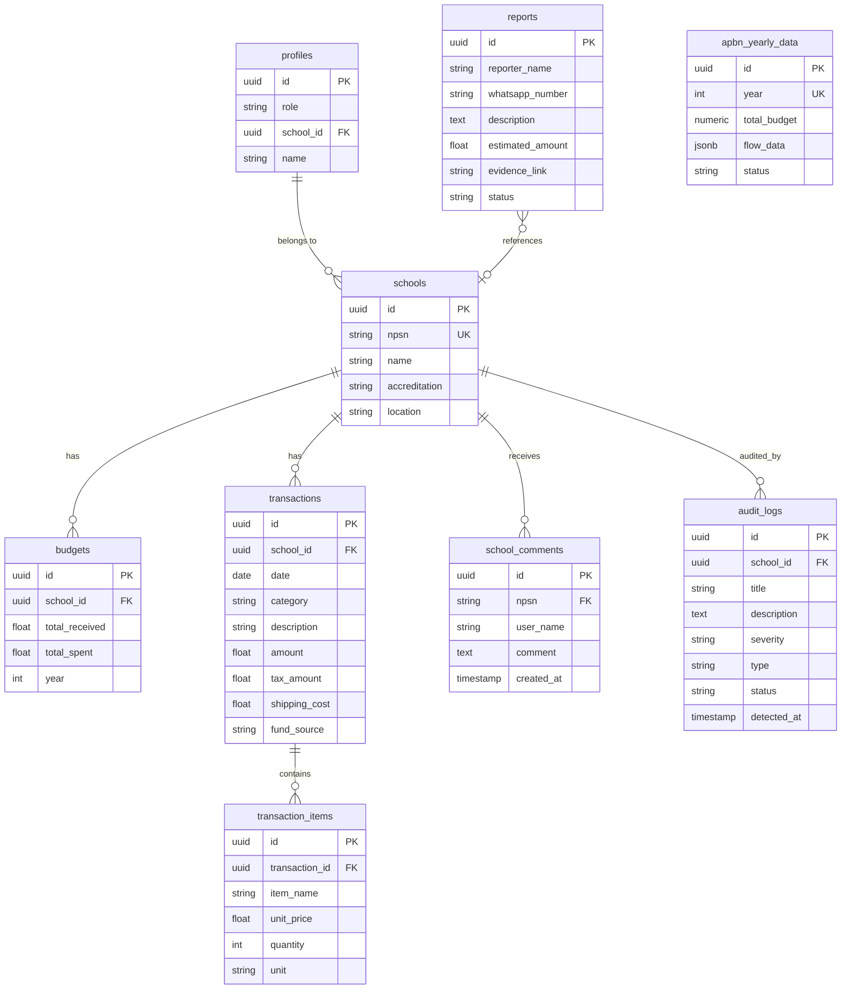
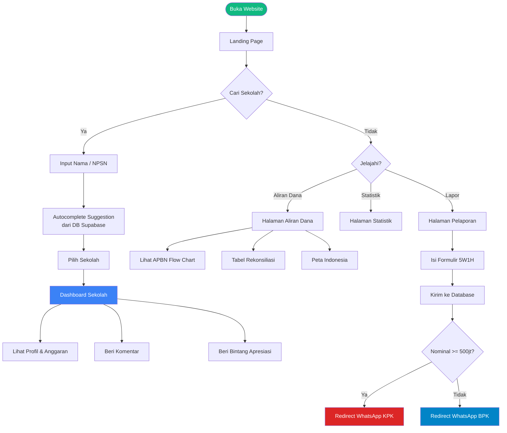
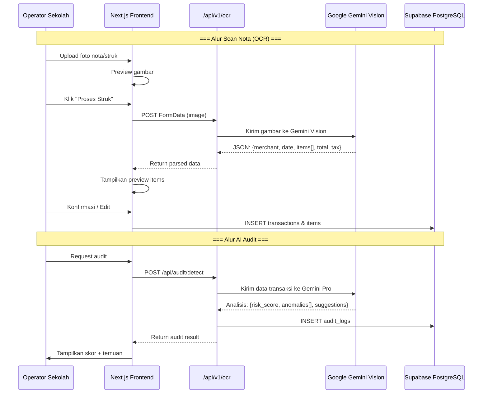

# 📋 DOKUMEN KONSOLIDASI: PRD, MVP, & FLOWCHART
## Portal Transparansi Anggaran Pendidikan Indonesia (BOS Online)

> **Status Dokumen:** Konsolidasi Final (v3.0)  
> **Tanggal Pembaruan:** 13 Juni 2026  
> **Aplikasi Aktif:** `apps/web-next` (Next.js 16.1.6 + Supabase + Gemini AI)  
> **Target Launch:** Fase 8 (PWA, Kecepatan Tinggi & Peluncuran Publik)  

[](https://vercel.com/new/clone?repository-url=https%3A%2F%2Fgithub.com%2Fadimaryanto-stack%2FTransparansi-Anggaran-Pendidikan&root-directory=apps/web-next&env=NEXT_PUBLIC_SUPABASE_URL,NEXT_PUBLIC_SUPABASE_ANON_KEY,GEMINI_API_KEY&project-name=transparansi-anggaran&repository-name=transparansi-anggaran)
[](https://insforge.dev/new?repo=https://github.com/adimaryanto-stack/Transparansi-Anggaran-Pendidikan&root=apps/web-next)

---

## 📑 DAFTAR ISI

1. [PENGANTAR & PENJELASAN KONSOLIDASI](#1-pengantar--penjelasan-konsolidasi)
2. [PRODUCT REQUIREMENTS DOCUMENT (PRD)](#2-product-requirements-document-prd)
   - [2.1 Latar Belakang & Masalah](#21-latar-belakang--masalah)
   - [2.2 Target Pengguna & Akses Role](#22-target-pengguna--akses-role)
   - [2.3 Fitur Utama Aplikasi Aktif](#23-fitur-utama-aplikasi-aktif)
   - [2.4 Rencana Integrasi Spreadsheet (Core Concept Legacy)](#24-rencana-integrasi-spreadsheet-core-concept-legacy)
3. [ARSITEKTUR & DATABASE SCHEMA](#3-arsitektur--database-schema)
   - [3.1 Skema Database (Supabase PostgreSQL)](#31-skema-database-supabase-postgresql)
   - [3.2 API Endpoints](#32-api-endpoints)
4. [MVP ROADMAP & RENCANA PENGEMBANGAN](#4-mvp-roadmap--rencana-pengembangan)
   - [4.1 Status MVP Saat Ini (Telah Selesai)](#41-status-mvp-saat-ini-telah-selesai)
   - [4.2 Roadmap Pengembangan Fase 8 (Sedang Berjalan)](#42-roadmap-pengembangan-fase-8-sedang-berjalan)
   - [4.3 Roadmap Spreadsheet Legacy (Referensi Pengembangan)](#43-roadmap-spreadsheet-legacy-referensi-pengembangan)
5. [METRIK KESUKSESAN & PENYELARASAN PAGE SPEED](#5-metrik-kesuksesan--penyelarasan-page-speed)
6. [DIAGRAM ALUR (FLOWCHART & JOURNEY)](#6-diagram-alur-flowchart--journey)

---

## 1. PENGANTAR & PENJELASAN KONSOLIDASI

Dokumen ini merupakan hasil penggabungan (konsolidasi) dari beberapa file spesifikasi sebelumnya, yaitu:
1. `prd.md` (Spesifikasi Awal Portal Publik & AI Audit BOS Online)
2. `PRD/MASTER_PRD.md` (Spesifikasi Dashboard Berbasis Spreadsheet)
3. `PRD/MVP_Roadmap_v2_Spreadsheet.md` (Rencana Pengembangan Aplikasi Spreadsheet)

### 🔄 Evolusi Proyek & Pembersihan Codebase

Sebelumnya, proyek ini memiliki dua cabang konsep desain/arsitektur paralel yang menyebabkan duplikasi kode:
* **Cabang A (BOS Online Public Portal & AI Audit):** Berfokus pada kemudahan akses publik, deteksi anomali anggaran menggunakan Gemini AI, upload nota/struk belanja dengan OCR, serta integrasi sistem pelaporan ke KPK/BPK.
* **Cabang B (Web-Based Spreadsheet Dashboard):** Berfokus pada interface interaktif menyerupai Excel untuk input cepat data anggaran bertingkat (Sekolah → Kab/Kota → Provinsi → Nasional) dengan inline editing dan cascade update database trigger.

Untuk mengurangi utang teknis (*technical debt*), meningkatkan kinerja, dan memaksimalkan nilai Google PageSpeed, kami telah melakukan **pembersihan codebase besar-besaran**:
1. **Menghapus Folder Duplikat:** Folder dashboard spreadsheet di tingkat root (`/app`, `/components`, `/lib`, `/types`, `/public`, `tsconfig.json`) telah dihapus.
2. **Menghapus Legacy Code:** Menghapus package tidak terpakai seperti `apps/api` (Express + SQLite + Prisma) dan `apps/web` (Vite + React) untuk memastikan aplikasi super ringan.
3. **Penyatuan ke Satu Aplikasi Utama:** Kode utama sepenuhnya menggunakan Next.js 16 (App Router) di dalam directory [apps/web-next](file:///d:/DaVinci/Web%20Development/dashboard-publik/apps/web-next).
4. **Optimasi Navbar:** Menghapus tombol *Login Admin* dan ikon *Mode Gelap* untuk menyederhanakan antarmuka publik dan mempercepat waktu muat (PageSpeed).
5. **Penyelamatan Data:** Directory [data/](file:///d:/DaVinci/Web%20Development/dashboard-publik/data) yang berisi data sekolah (NPSN) dan data wilayah (Kepmendagri 2025) tetap dipertahankan untuk kebutuhan seeding data Supabase.

> [!TIP]
> Navigasi cepat ke rencana pengembangan minimum layak produk dapat diakses melalui link berikut:  
> **👉 [Buka Detail MVP Roadmap](#4-mvp-roadmap--rencana-pengembangan)**

---

## 2. PRODUCT REQUIREMENTS DOCUMENT (PRD)

### 2.1 Latar Belakang & Masalah
Dana pendidikan di Indonesia rentan mengalami kebocoran anggaran pada setiap level penyaluran (dari APBN Pusat, APBD Provinsi/Kabupaten, hingga ke Sekolah dalam bentuk dana BOS). Kehadiran Portal Transparansi Anggaran ini bertujuan untuk:
1. Membuka akses pelacakan dana pendidikan dari hulu ke hilir secara transparan dan *real-time*.
2. Mendeteksi anomali belanja sekolah secara dini menggunakan kecerdasan buatan (Gemini AI).
3. Memberikan wadah pelaporan yang aman dan langsung terhubung dengan pihak berwenang (KPK/BPK) untuk laporan di atas/di bawah Rp 500 Juta.

### 2.2 Target Pengguna & Akses Role

| Role | Deskripsi | Hak Akses Utama |
|---|---|---|
| **PUBLIC** | Masyarakat umum, wali murid, LSM | Pencarian sekolah (NPSN), melihat aliran dana APBN, statistik nasional, memberikan komentar di forum sekolah, dan melakukan pelaporan (anonim). |
| **SCHOOL** | Operator/Bendahara sekolah | Melihat data sekolah sendiri, memasukkan data belanja, upload struk untuk scan OCR, melihat hasil audit anomali internal. |
| **AUDITOR (BPK/KPK)**| Pemeriksa Keuangan / Penyidik | Mengakses histori transaksi lengkap, logs audit anomali sistem, dan meninjau laporan masyarakat yang masuk. |
| **SUPER_ADMIN** | Administrator Sistem | Hak akses penuh: mengelola data APBN tahunan, data sekolah, manajemen user, serta moderasi komentar publik. |

### 2.3 Fitur Utama Aplikasi Aktif (`apps/web-next`)

1. **Pencarian Sekolah Publik:** Kolom pencarian di beranda dengan fitur autocomplete (debound query) langsung ke database sekolah di Supabase.
2. **Dashboard Sekolah Publik (`/dashboard/[npsn]`):** Ringkasan alokasi vs pengeluaran sekolah, histori transaksi belanja, visualisasi data, rating bintang dari warga, dan forum diskusi publik.
3. **Peta Distribusi Aliran Dana (`/aliran-dana`):** Visualisasi interaktif APBN → Kemendikbud → Dinas Provinsi → Kabupaten/Kota → Sekolah. Dilengkapi dengan bagan pohon aliran anggaran tahun 2020-2026.
4. **AI Audit & OCR Receipt Scanner:** Upload nota belanja sekolah → Gemini Vision otomatis mengekstrak item barang, kuantitas, dan harga. AI Audit Engine mendeteksi anomali harga markup secara *real-time*.
5. **Formulir Laporan 5W1H (`/reporting`):** Form pelaporan kasus korupsi. Sistem akan otomatis mengarahkan tombol kirim pesan ke WhatsApp KPK (jika temuan ≥ Rp 500 Juta) atau BPK (jika temuan < Rp 500 Juta) serta menyimpannya secara terenkripsi ke database.

### 2.4 Rencana Integrasi Spreadsheet (Core Concept Legacy)
Fitur spreadsheet excel-like dengan *inline editing* (dari `PRD/MASTER_PRD.md`) direncanakan untuk diintegrasikan pada panel khusus admin sekolah/operator untuk memudahkan input data secara massal.
* **Inline Editing:** Operator dapat mengubah alokasi/realisasi langsung pada baris tabel seperti Google Sheets.
* **Cascade Update Trigger:** Otomatis memperbarui akumulasi nilai ke atas (Sekolah → Kabupaten → Provinsi → Nasional) saat satu sel diedit.

---

## 3. ARSITEKTUR & DATABASE SCHEMA

Aplikasi berjalan di atas Next.js 16 (App Router), Tailwind CSS v4, dan menggunakan backend Supabase (PostgreSQL) dengan perlindungan Row Level Security (RLS).

### 3.1 Skema Database (Supabase PostgreSQL)



### 3.2 API Endpoints

| Endpoint | Method | Deskripsi |
|---|---|---|
| `/api/v1/ocr` | POST | Scan nota belanja otomatis menggunakan Gemini Vision. |
| `/api/v1/fund-flow` | GET | Mengambil alokasi dana nasional per tahun untuk diagram pohon. |
| `/api/v1/forecast` | GET | Prediksi anggaran tahun depan berdasarkan tren histori. |
| `/api/audit/detect`| POST | Menjalankan AI Audit untuk mendeteksi transaksi tidak wajar. |
| `/api/v1/public/*` | GET | Endpoint data publik untuk Provinsi, Kabupaten, dan Sekolah. |

---

## 4. MVP ROADMAP & RENCANA PENGEMBANGAN

Rencana pengembangan minimum layak produk (MVP) dibagi menjadi dua bagian: apa yang telah diselesaikan (Fase 1-7) dan apa yang sedang dikerjakan saat ini (Fase 8).

### 4.1 Status MVP Saat Ini (Telah Selesai) ✅
- **Fase 1-2 (Foundation):** Inisialisasi Next.js, integrasi Supabase PostgreSQL DB, setup Supabase Auth (Login/Signup/Forgot Password), RLS Policies.
- **Fase 3-4 (Core Features):** Diagram Aliran APBN, visualisasi data, integrasi Gemini AI Audit (markup detector), Dashboard Sekolah Publik, pencarian NPSN.
- **Fase 5 (OCR Integration):** Fitur upload struk nota, parser data visual Gemini Vision, penyimpanan otomatis ke tabel transaksi.
- **Fase 6 (Advanced Features):** Manajemen Multi-role (Super Admin, School, Auditor), Form pelaporan 5W1H dengan WhatsApp Redirect (KPK/BPK).
- **Fase 7 (UI Redesign):** Dashboard modern, layout SaaS clean, optimasi responsive mobile.

---

### 4.2 Roadmap Pengembangan Fase 8 (Sedang Berjalan) 🔄

Fase 8 berfokus pada **Kinerja Ekstrim (Google PageSpeed)**, optimalisasi PWA, dan penyederhanaan antarmuka agar aplikasi berjalan super ringan.

```
┌──────────────────────────────────────────────────────────────────────┐
│                    MVP FASE 8 & 9 PRIORITAS UTAMA                    │
├─────────────────────────┬──────────┬──────────┬──────────┬───────────┤
│ Fitur                   │ Target   │ Prioritas│ Status   │ PIC       │
├─────────────────────────┼──────────┼──────────┼──────────┼───────────┤
│ Penyelarasan PageSpeed  │ > 95%    │  🔴 HIGH │   🔄     │ Frontend  │
│ PWA Offline-First Cache │ 100%     │  🔴 HIGH │   🔄     │ Devops    │
│ Hapus Dark Mode & Admin │ Selesai  │  🔴 HIGH │   ✅     │ UI/UX     │
│ Dynamic totalIncome     │ DB-based │  🟡 MED  │   📋     │ Backend   │
│ Integrasi Dana APBD/CSR │ Schema   │  🟡 MED  │   📋     │ Data Eng  │
│ Konektor Bank Himbara   │ API Auth │  🟢 LOW  │   📋     │ Integrator│
└─────────────────────────┴──────────┴──────────┴──────────┴───────────┘
```

#### Rencana Aksi Detail Fase 8:
1. **Penyelarasan Cache Browser (PWA):**  
   File `apps/web-next/public/sw.js` telah dikonfigurasi ulang ke strategi **Network-First** untuk navigasi halaman utama (HTML) agar perubahan antarmuka langsung dirender tanpa tertahan cache. static assets lainnya menggunakan Stale-While-Revalidate.
2. **Pembersihan Modul:**  
   Menghapus seluruh file komponen mode gelap (`ThemeToggle.tsx`) dan melarang rendering tombol Login/Theme pada navbar publik.
3. **Peningkatan Google PageSpeed Score:**  
   - Mengganti browser default fonts dengan font modern yang dioptimasi via `next/font/google`.
   - Mengurangi bundle size dengan menghapus library Express/SQLite yang tidak terpakai dari workspace.
   - Pemanfaatan *Dynamic Imports* untuk grafik berat (Recharts) agar tidak memperlambat loading awal halaman.

---

### 4.3 Roadmap Spreadsheet Legacy (Referensi Pengembangan) 📋
*Diambil dari `PRD/MVP_Roadmap_v2_Spreadsheet.md` sebagai panduan jika modul spreadsheet inline-editing akan diimplementasikan sebagai fitur internal panel admin sekolah:*

* **Sprint 1 (Minggu 1-2):** Setup TanStack Table v8, inisialisasi state management Zustand untuk manipulasi baris sel, integrasi CRUD database level transaksi sekolah.
* **Sprint 2 (Minggu 3-4):** Pembuatan komponen `EditableCell.tsx`, pembuatan database trigger PostgreSQL untuk cascade updates (Sekolah → Kabkota → Provinsi).
* **Sprint 3 (Minggu 5-6):** Fitur filter bertingkat cascading (Provinsi → Kabkota), pagination server-side untuk menangani data besar (>150.000 sekolah), dan import massal data dari file Excel (.xlsx).
* **Sprint 4 (Minggu 7-8):** Role-Based Access Control (RBAC) pada inline-editing, ekspor excel menggunakan `ExcelJS` dengan formula matematika tetap aktif, audit trail logs untuk setiap edit sel.

---

## 5. METRIK KESUKSESAN & PENYELARASAN PAGE SPEED

Untuk mendukung target kecepatan tinggi dan aplikasi yang super ringan:

1. **Google PageSpeed Score:** Target skor minimal **95** pada Mobile dan Desktop.
2. **First Contentful Paint (FCP):** Kurang dari **0.8 detik** di jaringan 4G.
3. **Interactive Delay (FID):** Kurang dari **100 milidetik**.
4. **Data Integrity:** 100% kecocokan perhitungan total nominal belanja di dashboard dengan total penjumlahan transaksi di database Supabase (tidak ada data hardcoded).
5. **Offline Ready:** PWA dapat diakses dalam keadaan offline dengan data cache terkelola secara otomatis oleh Service Worker.

---

## 6. DIAGRAM ALUR (FLOWCHART & JOURNEY)

### 6.1 Alur Masyarakat Umum (Public User)



### 6.2 Alur Scan Nota (OCR) & AI Audit



---

*Dokumen ini merupakan panduan tunggal dan resmi bagi seluruh developer yang berpartisipasi dalam proyek ini.*
